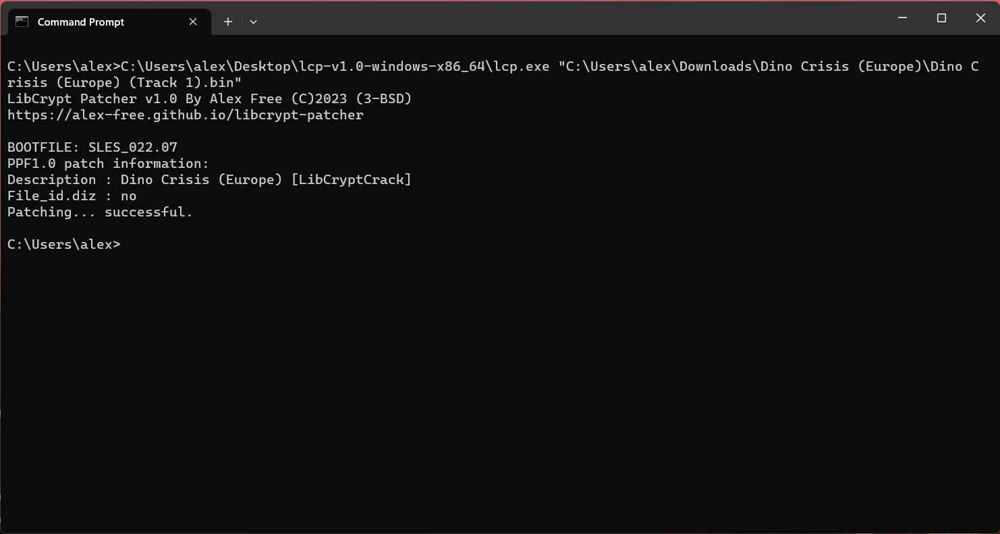
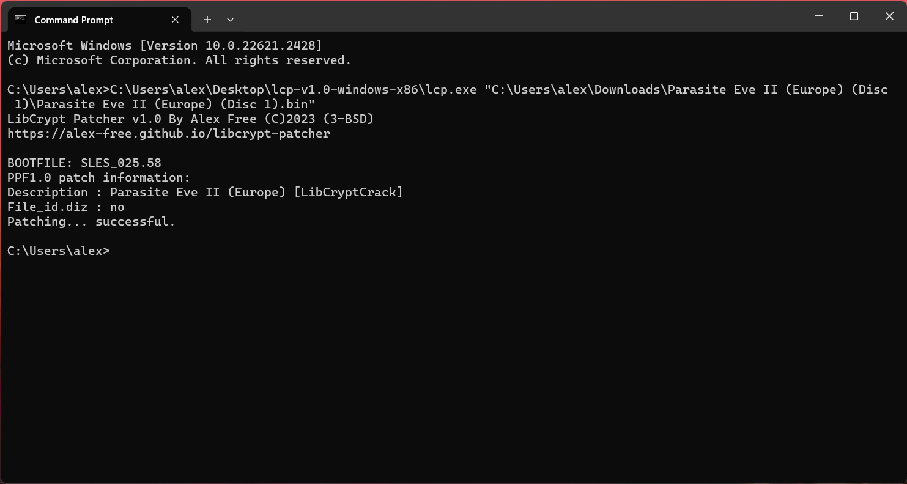
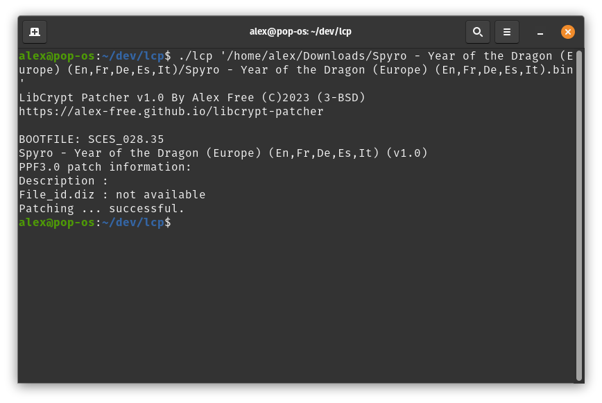
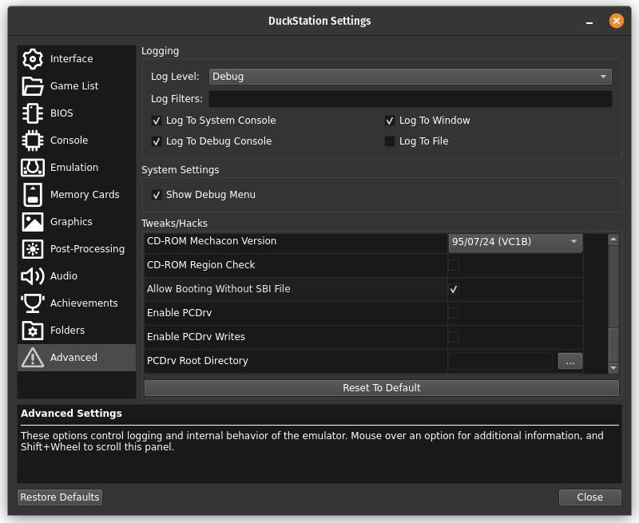
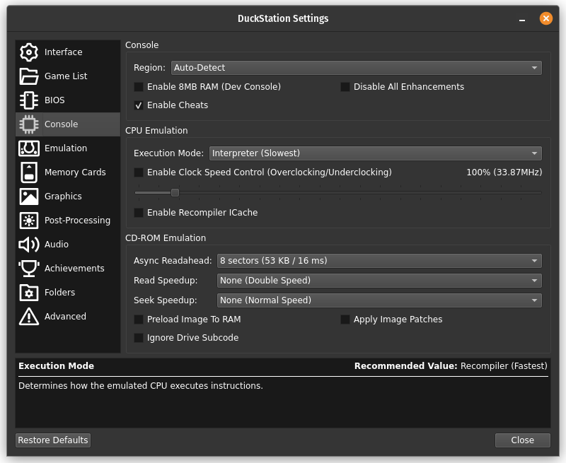

# LibCrypt Patcher

This patcher is capable of detecting and patching **237 different PSX game discs containing LibCrypt protection**. After using this patcher on a supported LibCrypt protected PSX disc image you can then:

*   Burn a backup CD-R with any burning software, **without any additional SBI files**. [IMGBurn](https://www.imgburn.com/), [CDRDAO](https://alex-free.github.io/cdrdao/), they all work with the patched image. The burned disc will **work on any real PS1/PS2 hardware.**

*   Use the disc image in an emulator **without needing SBI files**. [No $ PSX Emu](https://problemkaputt.de/psx.htm) works great (even on Linux with [Lutris/wine](https://lutris.net/)). So does [DuckStation](https://www.duckstation.org/) **with some [additional configuration](#duckstation-specific-instructions)**.

If you know of a game/revision this patcher does not yet support, can supply a better patch for a game, found an issue with an existing patch, or improve something else, please open a [Github issue](https://github.com/alex-free/libcrypt-patcher/issues). 

**My goal is to kill this protection once and for all.** This patcher aims to support every regional release, revision, prototype, and beta disc image containing LibCrypt!

## Links

| [GitHub](https://github.com/alex-free/libcrypt-patcher) | [Homepage](https://alex-free.github.io/libcrypt-patcher) | [GBATemp Thread](https://gbatemp.net/threads/libcrypt-patcher-single-executable-capable-of-patching-222-psx-game-discs.642132/) |

## Table Of Contents

*   [Downloads](#downloads)
*   [Supported Games](#supported-games)
*   [Credits](#credits)
*   [License](#license)
*   [Building From Source](build.md)

## Downloads

## Version 1.0.9 (2/26/2025)

Changes:

* Implemented new patches for [Final Fantasy VIII](https://github.com/alex-free/libcrypt-patcher/issues/14) thanks to [@davidmorom](https://github.com/davidmorom) (Europe, Spain, and Germany). These patches fix an issue that caused the game to lock up when you need to change to the next disc (this is a game spanning 4 different CD-ROMs). The new patches now work perfect.

* Fixed an [issue](https://github.com/alex-free/libcrypt-patcher/issues/12) where patching [This Is Football (Europe)](http://redump.org/disc/19757/) crashed the patcher.

* Updated the [EzRe](https://github.com/alex-free/ezre) build system to version 1.0.7. A Mac OS build is now available and can be compiled from source. RPM package files are now also available for Linux.

* Better arg parsing.

----------------------------------------------------

*	[libcrypt-patcher-v1.0.9-windows-i686-static.zip](https://github.com/alex-free/libcrypt-patcher/releases/download/v1.0.9/libcrypt-patcher-v1.0.9-windows-i686-static.zip) _Portable Release For Windows 95 OSR 2.5 and above, Pentium CPU minimum (32 bit)_

*	[libcrypt-patcher-v1.0.9-mac-os-x86_64.zip](https://github.com/alex-free/libcrypt-patcher/releases/download/v1.0.9/libcrypt-patcher-v1.0.9-mac-os-x86_64.zip) _Portable Release For Mac OS 10.12 and above, x86_64 (64 bit)_

*	[libcrypt-patcher-v1.0.9-windows-x86\_64-static.zip](https://github.com/alex-free/libcrypt-patcher/releases/download/v1.0.9/libcrypt-patcher-v1.0.9-windows-x86_64-static.zip) _Portable Release For x86_64 Windows (64 bit)_

*	[libcrypt-patcher-v1.0.9-linux-i386-static.zip](https://github.com/alex-free/libcrypt-patcher/releases/download/v1.0.9/libcrypt-patcher-v1.0.9-linux-i386-static.zip) _Portable Release For Linux 3.2.0 and above, 386 CPU minimum (32 bit)_

*	[libcrypt-patcher-v1.0.9-linux-i386-static.deb](https://github.com/alex-free/libcrypt-patcher/releases/download/v1.0.9/libcrypt-patcher-v1.0.9-linux-i386-static.deb) _Deb package file For Linux 3.2.0 and above, 386 CPU minimum (32 bit)_

*	[libcrypt-patcher-1.0.9-1.i386.rpm](https://github.com/alex-free/libcrypt-patcher/releases/download/v1.0.9/libcrypt-patcher-1.0.9-1.i386.rpm) _RPM package file For Linux 3.2.0 and above, 386 CPU minimum (32 bit)_

*	[libcrypt-patcher-v1.0.9-linux-x86\_64-static.zip](https://github.com/alex-free/libcrypt-patcher/releases/download/v1.0.9/libcrypt-patcher-v1.0.9-linux-x86_64-static.zip) _Portable Release For x86\_64 Linux 3.2.0 and above (64 bit)_

*	[libcrypt-patcher-v1.0.9-linux-x86\_64-static.deb](https://github.com/alex-free/libcrypt-patcher/releases/download/v1.0.9/libcrypt-patcher-v1.0.9-linux-x86_64-static.deb) _Deb package file for x86_64 Linux 3.2.0 and above (64 bit)_

*	[libcrypt-patcher-1.0.9-1.x86_64.rpm](https://github.com/alex-free/libcrypt-patcher/releases/download/v1.0.9/libcrypt-patcher-1.0.9-1.x86_64.rpm) _RPM package file For Linux 3.2.0 and above, x86_64 CPU minimum (64 bit)_

---------------------------------------

[Previous Versions](changelog.md)

## Usage

### Windows

The easiest way to use this on Windows is to simply drag the first/only data track bin file of the LibCrypt protected CD image onto the `lcp.exe` executable file.

Alternatively you may run `cmd.exe` or `command.com` and run `lcp.exe` with the first/only data track bin file as the sole argument.

### Linux

For use on Linux, you have a variety of options:

1) Install the `.deb` package and execute it as a standard command (`lcp`), with the first/only data track bin file as the sole argument.
2) Unzip the portable `.zip` and execute the `lcp` command within the release, with the first/only data track bin file as the sole argument.
3) Drag the first/only data track bin file of the LibCrypt protected CD image onto the `lcp` executable file (only supported by some Linux window managers).

### DuckStation Specific Instructions

Duckstation needs some configuration before the patched disc image will work:

1) In `Settings`->`Advanced`->`Tweaks/Hacks` **scroll down and check** `Allow booting without SBI File`.

2) (For Formula One 99 (Europe) (En,Fr,De,It) (prototype 8/12/1999) only!!) - In `Settings`->`Console`->`CPU Mode` **assign `Execution Mode` to `Interpreter (Slowest)`**. This is needed to a **work around a [bug in DuckStation](https://github.com/alex-free/libcrypt-patcher/issues/6) specific to only Formula One 99 (Europe) (En,Fr,De,It) (prototype 8/12/1999) and is not neccesary for any other disc image.**

## Supported Games

[Actua Ice Hockey 2 (Europe)](http://redump.org/disc/5120/)

[Anstoss: Premier Manager (Germany)](http://redump.org/disc/3334/)

[Ape Escape (Europe)](http://redump.org/disc/6147/)

[Ape Escape (France)](http://redump.org/disc/995/)

[Ape Escape (Germany)](http://redump.org/disc/26604/)

[Ape Escape (Italy)](http://redump.org/disc/27680/)

[Ape Escape: La Invasion de los Monos (Spain)](http://redump.org/disc/1128/)

[Asterix: Mega Madness (Europe) (En,Fr,De,Es,It,Nl)](http://redump.org/disc/4873/)

[Barbie: Aventure Equestre (France)](http://redump.org/disc/29560/)

[Barbie: Race & Ride (Europe)](http://redump.org/disc/11318/)

[Barbie: Race & Ride (Germany)](http://redump.org/disc/25241/)

[Barbie: Race & Ride (Italy)](http://redump.org/disc/28330/)

[Barbie: Race & Ride (Spain)](http://redump.org/disc/25983/)

[Barbie: Sports Extreme (France)](http://redump.org/disc/28149/)

[Barbie: Super Sport (Germany)](http://redump.org/disc/26734/)

[Barbie: Super Sports (Europe)](http://redump.org/disc/29290/)

[Barbie: Super Sports (Italy)](http://redump.org/disc/35294/)

[Barbie: Super Sports (Spain)](http://redump.org/disc/5579/)

[BDFL Manager 2001 (Germany)](http://redump.org/disc/17767/)

[BDFL Manager 2002 (Germany)](http://redump.org/disc/3320/)

[Canal+ Premier Manager (Europe) (Fr,Es,It)](http://redump.org/disc/27297/)

[Crash Bash (Europe) (En,Fr,De,Es,It)](http://redump.org/disc/5483/)

[CTR: Crash Team Racing (Europe) (En,Fr,De,Es,It,Nl) (EDC)](http://redump.org/disc/897/)

[CTR: Crash Team Racing (Europe) (En,Fr,De,Es,It,Nl) (No EDC)](http://redump.org/disc/798/)

[Dino Crisis (Europe)](http://redump.org/disc/710/)

[Dino Crisis (France)](http://redump.org/disc/24278/)

[Dino Crisis (Germany)](http://redump.org/disc/7586/)

[Dino Crisis (Italy)](http://redump.org/disc/28171/)

[Dino Crisis (Spain)](http://redump.org/disc/27940/)

[Disney Libro Animato Creativo: Mulan (Italy)](http://redump.org/disc/28327/)

[Disney Tarzan (France)](http://redump.org/disc/29462/)

[Disney Tarzan (Spain)](http://redump.org/disc/27287/)

[Disney's 102 Dalmatians: Puppies to the Rescue (Europe) (Fr,De,Es,It,Nl)](http://redump.org/disc/19140/)

[Disney's 102 Dalmatians: Puppies to the Rescue (Europe)](http://redump.org/disc/58589/)

[Disney's 102 Dalmatians: Puppies to the Rescue (Scandinavia)](http://redump.org/disc/53874/)

[Disney's Aventura Interactiva: Mulan (Spain)](http://redump.org/disc/17311/)

[Disney Fais Ton Histoire! Mulan (France)](http://redump.org/disc/27819/)

[Disney Libro Animato Creativo: Mulan (Italy)](http://redump.org/disc/28327/)

[Disney's Tarzan (Europe)](http://redump.org/disc/29818/)

[Disneys Tarzan (Netherlands)](http://redump.org/disc/27067/)

[Disneyn Tarzan (Finland)](http://redump.org/disc/48938/) 

[Disneys Tarzan (Denmark)](http://redump.org/disc/51711/)

[Disney's Tarzan (Sweden)](http://redump.org/disc/6885/)

[Disney's Verhalenstudio: Mulan (Netherlands)](http://redump.org/disc/27076/)

[Disneys Interaktive Abenteuer: Mulan (Germany)](http://redump.org/disc/19124/)

[Disney's Mulan: Story Studio (Europe)](http://redump.org/disc/6887/)

[Disneys Tarzan (Germany)](http://redump.org/disc/19124/)

[Disneys Tarzan (Italy)](http://redump.org/disc/27824/)

[EA Sports Superbike 2000 (Europe) (En,Fr,De,Es,It,Sv)](http://redump.org/disc/26580/)

[Eagle One: Harrier Attack (Europe) (En,Fr,De,Es,It)](http://redump.org/disc/880/)

[Esto es Futbol (Spain)](http://redump.org/disc/25328/)

[The F.A. Premier League Football Manager 2001 (Europe)](http://redump.org/disc/6867/)

[F1 2000 (Europe) (En,Es,Sv,Da,Fi)](http://redump.org/disc/6867/)

[F1 2000 (Europe) (En,Fr,De,Nl)](http://redump.org/disc/4311/)

[F1 2000 (Italy)](http://redump.org/disc/29597/)

[Final Fantasy IX (Europe) (Disc 1)](http://redump.org/disc/2371/)

[Final Fantasy IX (Europe) (Disc 2)](http://redump.org/disc/2370/)

[Final Fantasy IX (Europe) (Disc 3)](http://redump.org/disc/2370/)

[Final Fantasy IX (Europe) (Disc 4)](http://redump.org/disc/2373/)

[Final Fantasy IX (France) (Disc 1)](http://redump.org/disc/2455/)

[Final Fantasy IX (France) (Disc 2)](http://redump.org/disc/2456/)

[Final Fantasy IX (France) (Disc 3)](http://redump.org/disc/2457/)

[Final Fantasy IX (France) (Disc 4)](http://redump.org/disc/2458/)

[Final Fantasy IX (Germany) (Disc 1)](http://redump.org/disc/737/)

[Final Fantasy IX (Germany) (Disc 2)](http://redump.org/disc/738/)

[Final Fantasy IX (Germany) (Disc 3)](http://redump.org/disc/739/)

[Final Fantasy IX (Germany) (Disc 4)](http://redump.org/disc/740/)

[Final Fantasy IX (Italy) (Disc 1)](http://redump.org/disc/2714/)

[Final Fantasy IX (Italy) (Disc 2)](http://redump.org/disc/2714/)

[Final Fantasy IX (Italy) (Disc 3)](http://redump.org/disc/2714/)

[Final Fantasy IX (Italy) (Disc 4)](http://redump.org/disc/2714/)

[Final Fantasy IX (Spain) (Disc 1)](http://redump.org/disc/1113/)

[Final Fantasy IX (Spain) (Disc 2)](http://redump.org/disc/1114/)

[Final Fantasy IX (Spain) (Disc 3)](http://redump.org/disc/1115/)

[Final Fantasy IX (Spain) (Disc 4)](http://redump.org/disc/1114/)

[Final Fantasy VIII (Europe, Australia) (Disc 1)](http://redump.org/disc/866/)

[Final Fantasy VIII (Europe, Australia) (Disc 2)](http://redump.org/disc/875/)

[Final Fantasy VIII (Europe, Australia) (Disc 3)](http://redump.org/disc/873/)

[Final Fantasy VIII (Europe, Australia) (Disc 4)](http://redump.org/disc/874/)

[Final Fantasy VIII (France) (Disc 1)](http://redump.org/disc/4028/)

[Final Fantasy VIII (France) (Disc 2)](http://redump.org/disc/4029/)

[Final Fantasy VIII (France) (Disc 3)](http://redump.org/disc/4030/)

[Final Fantasy VIII (France) (Disc 4)](http://redump.org/disc/4031/)

[Final Fantasy VIII (Germany) (Disc 1)](http://redump.org/disc/733/)

[Final Fantasy VIII (Germany) (Disc 2)](http://redump.org/disc/734/)

[Final Fantasy VIII (Germany) (Disc 3)](http://redump.org/disc/735/)

[Final Fantasy VIII (Germany) (Disc 4)](http://redump.org/disc/736/)

[Final Fantasy VIII (Italy) (Disc 1)](http://redump.org/disc/1587/)

[Final Fantasy VIII (Italy) (Disc 2)](http://redump.org/disc/1588/)

[Final Fantasy VIII (Italy) (Disc 3)](http://redump.org/disc/1589/)

[Final Fantasy VIII (Italy) (Disc 4)](http://redump.org/disc/1590/)

[Final Fantasy VIII (Spain) (Disc 1)](http://redump.org/disc/1109/)

[Final Fantasy VIII (Spain) (Disc 2)](http://redump.org/disc/1110/)

[Final Fantasy VIII (Spain) (Disc 3)](http://redump.org/disc/1111/)

[Final Fantasy VIII (Spain) (Disc 4)](http://redump.org/disc/1112/)

[Football Manager Campionato 2001 (Italy)](http://redump.org/disc/29597/)

[Formula One 99 (Europe) (En,Es,Fi)](http://redump.org/disc/31126/)

[Formula One 99 (Europe) (En,Fr,De,It)](http://redump.org/disc/969/)

[Formula One 99 (Europe) (En,Fr,De,It) (Beta 9/9/1999)](http://redump.org/disc/64499/)

Formula One 99 (Europe) (En,Fr,De,It) (prototype 8/12/1999) - find it on hiddenpalace, no redump page exists!

[Frontschweine (Germany)](http://redump.org/disc/19539/)

[Fussball Live (Germany)](http://redump.org/disc/4385/)

[Fussball Manager 2001 (Germany)](http://redump.org/disc/7516/)

[Football Manager Campionato 2002 (Italy)](http://redump.org/disc/48369/)

[Manager de Liga (Spain) (Beta)](http://redump.org/disc/3413/)

[Manager de Liga 2001 (Spain)](http://redump.org/disc/48045/)

[Manager de Liga 2002 (Spain)](http://redump.org/disc/48045/)

[Galerians (Europe) (Disc 1)](http://redump.org/disc/7420/)

[Galerians (Europe) (Disc 2)](http://redump.org/disc/7421/)

[Galerians (Europe) (Disc 3)](http://redump.org/disc/7422/)

[Galerians (France) (Disc 1)](http://redump.org/disc/13382/)

[Galerians (France) (Disc 2)](http://redump.org/disc/13383/)

[Galerians (France) (Disc 3)](http://redump.org/disc/13384/)

[Galerians (Germany) (Disc 1)](http://redump.org/disc/7695/)

[Galerians (Germany) (Disc 2)](http://redump.org/disc/7696/)

[Galerians (Germany) (Disc 3)](http://redump.org/disc/7697/)

[Gekido: Urban Fighters (Europe) (En,Fr,De,Es,It)](http://redump.org/disc/833/)

[Hogs of War (Europe)](http://redump.org/disc/703/)

[Hogs of War: Nati per Soffritto](http://redump.org/disc/48020/)

[The Italian Job (Europe)](http://redump.org/disc/617/)

[The Italian Job (Europe) (Fr,De,Es)](http://redump.org/disc/5819/)

[The Italian Job (Italy)](http://redump.org/disc/47605/)

[Jackie Chan Stuntmaster (Europe)](http://redump.org/disc/3985/)

[Jackie Chan Stuntmaster (Europe) (Recalled)](http://redump.org/disc/64315/)

[Le Mans 24 Hours (Europe) (En,Fr,De,Es,It,Pt)](http://redump.org/disc/1659/)

[Le Monde des Bleus: Le Jeu Officiel de l'Équipe de France (France)](http://redump.org/disc/8346/)

[Legacy of Kain: Soul Reaver (Europe)](http://redump.org/disc/1177/)

[Legacy of Kain: Soul Reaver (France)](http://redump.org/disc/24279)

[Legacy of Kain: Soul Reaver (Germany)](http://redump.org/disc/393/)

[Legacy of Kain: Soul Reaver (Italy)](http://redump.org/disc/28167/)

[Legacy of Kain: Soul Reaver (Spain)](http://redump.org/disc/27944/)

[Les Cochons de Guerre (France) (Rev 0)](http://redump.org/disc/33070/)

[Les Cochons de Guerre (France) (Rev 1)](http://redump.org/disc/99695/)

[Marranos en Guerra (Spain)](http://redump.org/disc/48791/)

[LMA Manager 2001 (Europe)](http://redump.org/disc/6847/)

[LMA Manager 2001 (Europe) (Beta 02/26/2001)](http://redump.org/disc/92303/)

[LMA Manager 2002 (Europe)](http://redump.org/disc/26750/)

[Lucky Luke: Western Fever (Europe) (En,Fr,De,Es,It,Nl)](http://redump.org/disc/19142/)

[MediEvil (Europe)](http://redump.org/disc/592/)

[MediEvil (France)](http://redump.org/disc/13389/)

[MediEvil (Germany)](http://redump.org/disc/25542/)

[MediEvil (Italy)](http://redump.org/disc/29475/)

[MediEvil (Spain)](http://redump.org/disc/1584/)

[MediEvil 2 (Europe) (En,Fr,De)](http://redump.org/disc/593/)

[MediEvil 2 (Europe) (Es,It,Pt)](http://redump.org/disc/1547/)

[MediEvil 2 (Russia)](http://redump.org/disc/2625/)

[Men in Black: The Series: Crashdown (Europe)](http://redump.org/disc/30764/)

[Men in Black: The Series: Crashdown (France)](http://redump.org/disc/28185/)

[Men in Black: The Series: Crashdown (Germany)](http://redump.org/disc/17711/)

[Men in Black: The Series: Crashdown (Italy)](http://redump.org/disc/28025/)

[Men in Black: The Series: Crashdown (Spain)](http://redump.org/disc/27937/)

[Michelin Rally Masters: Race of Champions (Europe) (En,De,Sv)](http://redump.org/disc/25913/)

[Michelin Rally Masters: Race of Champions (Europe) (Fr,Es,It)](http://redump.org/disc/28160/)

[Mike Tyson Boxing (Europe) (En,Fr,De,Es,It)](http://redump.org/disc/5823/)

[Mission: Impossible (Europe) (En,Fr,De,Es,It)](http://redump.org/disc/1176/)

[MoHo (Europe) (En,Fr,De,Es,It)](http://redump.org/disc/15091/)

[Monde des Bleus, Le: Le jeu officiel de l'equipe de France (France)](http://redump.org/disc/8346/)

[N-Gen Racing (Europe) (En,Fr,De,Es,It)](http://redump.org/disc/1010/)

[Need for Speed: Porsche 2000 (Europe) (En,De,Sv)](http://redump.org/disc/622/)

[Need for Speed: Porsche 2000 (Europe) (Fr,Es,It)](http://redump.org/disc/3933/)

[OverBlood 2 (Europe) (Disc 1) (v1.0)](http://redump.org/disc/26606/)

[OverBlood 2 (Europe) (Disc 2) (v1.0)](http://redump.org/disc/26607/)

[OverBlood 2 (Italy) (Disc 1)](http://redump.org/disc/35017/)

[OverBlood 2 (Italy) (Disc 2)](http://redump.org/disc/35018/)

[Parasite Eve II (Europe) (Disc 1)](http://redump.org/disc/118/)

[Parasite Eve II (Europe) (Disc 2)](http://redump.org/disc/119/)

[Parasite Eve II (France) (Disc 1)](http://redump.org/disc/13381/)

[Parasite Eve II (France) (Disc 2)](http://redump.org/disc/13380/)

[Parasite Eve II (Germany) (Disc 1)](http://redump.org/disc/4307/)

[Parasite Eve II (Germany) (Disc 2)](http://redump.org/disc/4308/)

[Parasite Eve II (Italy) (Disc 1)](http://redump.org/disc/29442/)

[Parasite Eve II (Italy) (Disc 2)](http://redump.org/disc/29443/)

[Parasite Eve II (Spain) (Disc 1)](http://redump.org/disc/1122/)

[Parasite Eve II (Spain) (Disc 2)](http://redump.org/disc/1123/)

[PGA European Tour Golf (Europe) (En,De)](http://redump.org/disc/772/)

[PGA European Tour Golf (Fr, It, Es) (Europe)](http://redump.org/disc/46131/)

[PGA European Tour Golf (Fr, It, Es) (Alt) (Europe)](http://redump.org/disc/56471/)

[Premier Manager 2000 (Europe)](http://redump.org/disc/3619/)

[Prince Naseem Boxing (Europe) (En,Fr,De,Es,It)](http://redump.org/disc/3309/)

[Radikal Bikers (Europe) (En,Fr,De,Es,It)](http://redump.org/disc/25908/)

[RC Revenge (Europe) (En,Fr,De,Es)](http://redump.org/disc/5127/)

[Resident Evil 3: Nemesis (Europe)](http://redump.org/disc/496/)

[Resident Evil 3: Nemesis (France)](http://redump.org/disc/9753/)

[Resident Evil 3: Nemesis (Germany)](http://redump.org/disc/5526/)

[Resident Evil 3: Nemesis (Ireland)](http://redump.org/disc/28197/)

[Resident Evil 3: Nemesis (Italy)](http://redump.org/disc/16397/)

[Resident Evil 3: Nemesis (Spain)](http://redump.org/disc/1387/)

[Roger Lemerre: La Sélection des Champions 2002 (France)](http://redump.org/disc/49266/)

[Ronaldo V-Football (Europe) (De,Es,It,Pt)](http://redump.org/disc/7755)

[Ronaldo V-Football (Europe) (En,Fr,Nl,Sv)](http://redump.org/disc/17746/)

[SaGa Frontier 2 (Europe)](http://redump.org/disc/280/)

[SaGa Frontier 2 (France)](http://redump.org/disc/28278/)

[SaGa Frontier 2 (Germany)](http://redump.org/disc/2605/)

[SnoCross Championship Racing (Europe) (En,Fr,De,Es,It)](http://redump.org/disc/3705/)

[Space Debris (Europe)](http://redump.org/disc/29918/)

[Space Debris (France)](http://redump.org/disc/29512/)

[Space Debris (Germany)](http://redump.org/disc/20213/)

[Space Debris (Germany) (Beta 11/11/1999)](http://redump.org/disc/85814/)

[Space Debris (Italy)](http://redump.org/disc/29592/)

[Space Debris (Spain)](http://redump.org/disc/48046/)

[Speed Freaks (Europe)](http://redump.org/disc/1250/)

[Spyro: Year of the Dragon (Europe) (En,Fr,De,Es,It) (Rev 0)](http://redump.org/disc/492/)

[Spyro: Year of the Dragon (Europe) (En,Fr,De,Es,It) (Rev 1)](http://redump.org/disc/19611/)

[Spyro 2: Gateway to Glimmer (Europe) (En,Fr,De,Es,It)](http://redump.org/disc/1250/)

[Sydney 2000 (Europe)](http://redump.org/disc/7460/)

[Sydney 2000 (France)](http://redump.org/disc/15759/)

[Sydney 2000 (Germany)](http://redump.org/disc/15759/)

[Sydney 2000 (Spain)](http://redump.org/disc/27884/)

[Sydney 2000 (Australia)](http://redump.org/disc/62664/)

[TechnoMage: De Terugkeer der Eeuwigheid (Netherlands)](http://redump.org/disc/27310/)

[TechnoMage: Die Rueckkehr der Ewigkeit (Germany)](http://redump.org/disc/25284/)

[TechnoMage: En Quete de L'Eternite (France)](http://redump.org/disc/27310/)

[TechnoMage: Return of Eternity (Europe)](http://redump.org/disc/12627/)

[Technomage: El Retorno de la Eternidad (Spain)](http://redump.org/disc/49569/)

[TechnoMage: Ritorno all'Eternità (Italy)](http://redump.org/disc/46130/)

[Theme Park World (Europe) (En,Fr,De,Es,It,Nl,Sv)](http://redump.org/disc/910/)

[This Is Football (Europe) (Fr,Nl)](http://redump.org/disc/19757/)

[This Is Football (Europe)](http://redump.org/disc/4004/)

[This Is Football (Italy)](http://redump.org/disc/28048/)

[This Is Soccer (Australia)](http://redump.org/disc/46676/)

[TOCA World Touring Cars (Europe) (En,Fr,De)](http://redump.org/disc/615/)

[TOCA World Touring Cars (Europe) (Es,It)](http://redump.org/disc/27567/)

[UEFA Euro 2000 (Europe)](http://redump.org/disc/1793/)

[UEFA Euro 2000 (France)](http://redump.org/disc/28153/)

[UEFA Euro 2000 (Germany)](http://redump.org/disc/5528/)

[UEFA Euro 2000 (Italy)](http://redump.org/disc/28346/)

[UEFA Euro 2000 (Spain)](http://redump.org/disc/50591/)

[UEFA Striker (Europe) (En,Fr,De,Es,It,Nl)](http://redump.org/disc/7446/)

[Urban Chaos (Europe) (En,Es,It)](http://redump.org/disc/618/)

[Urban Chaos (France)](http://redump.org/disc/50247/)

[Urban Chaos (Germany)](http://redump.org/disc/17768/)

[V-Rally: Championship Edition 2 (Europe) (En,Fr,De)](http://redump.org/disc/1063/)

[Vagrant Story (Europe)](http://redump.org/disc/9978/)

[Vagrant Story (France)](http://redump.org/disc/12636/)

[Vagrant Story (Germany)](http://redump.org/disc/548/)

[Walt Disney World Quest: Magical Racing Tour (Europe) (En,Fr,De,Es,It,Nl,Sv,No,Da)](http://redump.org/disc/1848/)

[Wip3out (Europe) (En,Fr,De,Es,It)](http://redump.org/disc/355/)

## Credits

### Icarus/Paradox

**Massive** thanks to Icarus/Paradox for releasing the PPF source under open terms:

`***************************`

`ApplyPPF3.c (Linux Version)`

`written by Icarus/Paradox`

`Big Endian support by Hu Kares.`

`Applies PPF1.0, PPF2.0 & PPF3.0 Patches (including PPF3.0 Undo support)`

`Feel free to use this source in and for your own programms.`

`***************************`

 I was able to change `applyppf3_linux.c` (I have included the full PPF Paradox distribution in the source code for reference, see the `pdx-ppf3` directory) into a small C library (filename is `libppf.c`) that I could call into from a function, applying internally contained `const unsigned char` arrays based on boot file/version detection hence making this whole thing possible once I assembled all of the PPF patches.

 ### [Agrippa](https://www.psx-place.com/members/agrippa.40805/)

 They released proper Spyro: Year of the Dragon (Europe) (En,Fr,De,Es,It) (v1.0.1), Spyro: Year of the Dragon (Europe) (En,Fr,De,Es,It) (v1.1), and Sydney 2000 (Europe) LibCrypt patches as well as some interesting info on patching LibCrypt.

### [Snowbro88](https://gbatemp.net/members/snowbro88.421566/)

Posted about [an archive](https://gbatemp.net/threads/new-mode-to-fix-ps1-games-for-psp-and-psvita.607286/page-19#post-10261296) of LibCrypt patches, making this very easy to put together once all documented and configured.

### [LittleMouse1968](https://github.com/Littlemouse1968)

*   Wrote patches for [Formula One 99 (Europe) (En,Fr,De,It) (Beta 9/9/1999)](http://redump.org/disc/64499/), [Space Debris (Germany) (Beta 11/11/1999)](http://redump.org/disc/85814/), [LMA Manager 2001 (Europe) (Beta 02/26/2001)](http://redump.org/disc/92303/), and Formula One 99 (Europe) (En,Fr,De,It) (prototype 8/12/1999).

*   Provided an improved patch for [Les Cochons de Guerre (France) Rev 0](http://redump.org/disc/33070/) and [Les Cochons de Guerre (France) Rev 1](http://redump.org/disc/99695/).

*   Provided all new Final Fantasy IX patches, fixing an issue older patches (including Paradox!) had when changing to the next disc in the game.

### Everyone Else Who Did The Original Patches

Thanks to your work, I was able to put all of this together! I hope to better document the patch credits in a future update.

## License

Libcrypt Patcher is released under the 3-BSD license, see the file [license.md](license.md) for complete information.
